# 🚀 Comprehensive Deployment Flows Guide

## 📋 Overview

This document provides a complete reference for all deployment flows in our shared workflows architecture, from Git events to final deployments. It covers deployment workflows, security scanning workflows, and their interactions.

## 🏗️ Architecture Overview

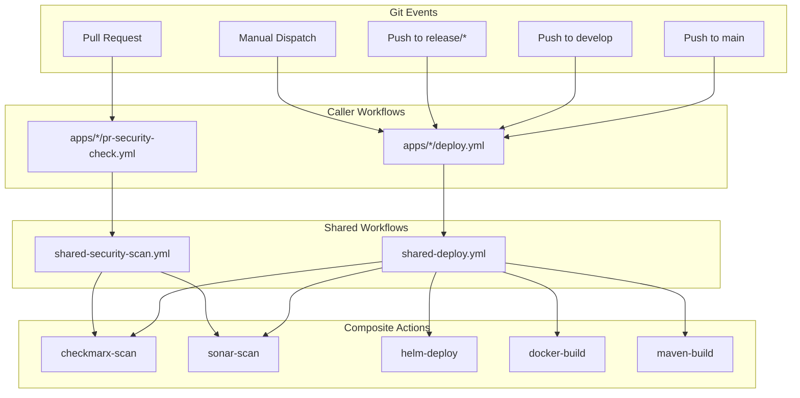

---

## 🔄 Deployment Workflow Flows

### 1. 🌟 Push to Main Branch → Staging Deployment

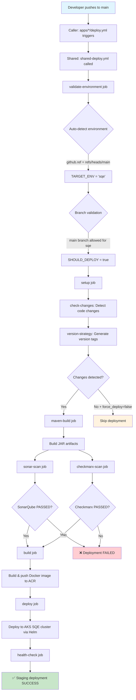

**Key Points:**
- **Trigger**: Push to `main` branch
- **Target**: SQE/Staging environment
- **Auto-detection**: `main` → `sqe` environment
- **Security Gates**: Both SonarQube and Checkmarx must PASS
- **Final Step**: Health check validation

---

### 2. 🛠️ Push to Develop Branch → Dev Deployment

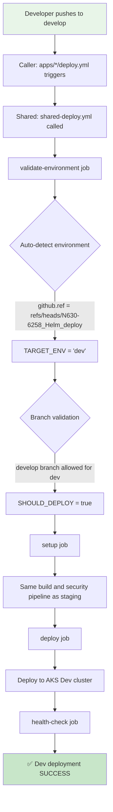

**Key Points:**
- **Trigger**: Push to `develop` branch (`N630-6258_Helm_deploy`)
- **Target**: Dev environment
- **Pipeline**: Same security gates as staging
- **Cluster**: AKS Dev cluster

---

### 3. 🚀 Push to Release Branch → Production Deployment

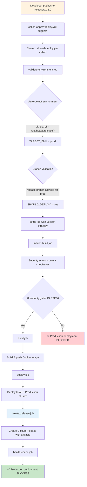

**Key Points:**
- **Trigger**: Push to `release/*` branch or Git tags
- **Target**: Production environment
- **Extra Step**: GitHub release creation
- **Security**: Strictest validation - both scans must PASS
- **Cluster**: AKS Production cluster

---

### 4. 🎯 Manual Dispatch → Custom Environment

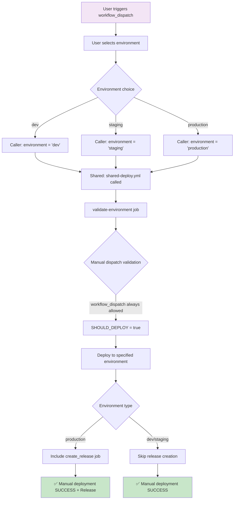

**Key Points:**
- **Trigger**: Manual workflow dispatch
- **Flexibility**: Can deploy any branch to any environment
- **Override**: Bypasses branch restrictions
- **Control**: User specifies target environment explicitly

---

## 🔒 Security Scanning Flows

### 1. 📥 Pull Request → Security Analysis Only

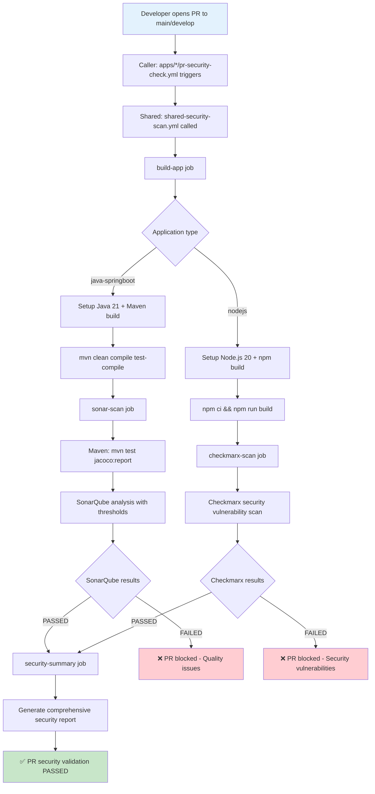

**Key Points:**
- **Trigger**: Pull request to `main` or `develop`
- **No Deployment**: Security analysis only
- **App-Specific**: Each app has its own security workflow
- **Configurable**: Different thresholds per application
- **Blocking**: Failed security scans block PR merge

---

### 2. 🔍 Security Scan Details by Application Type

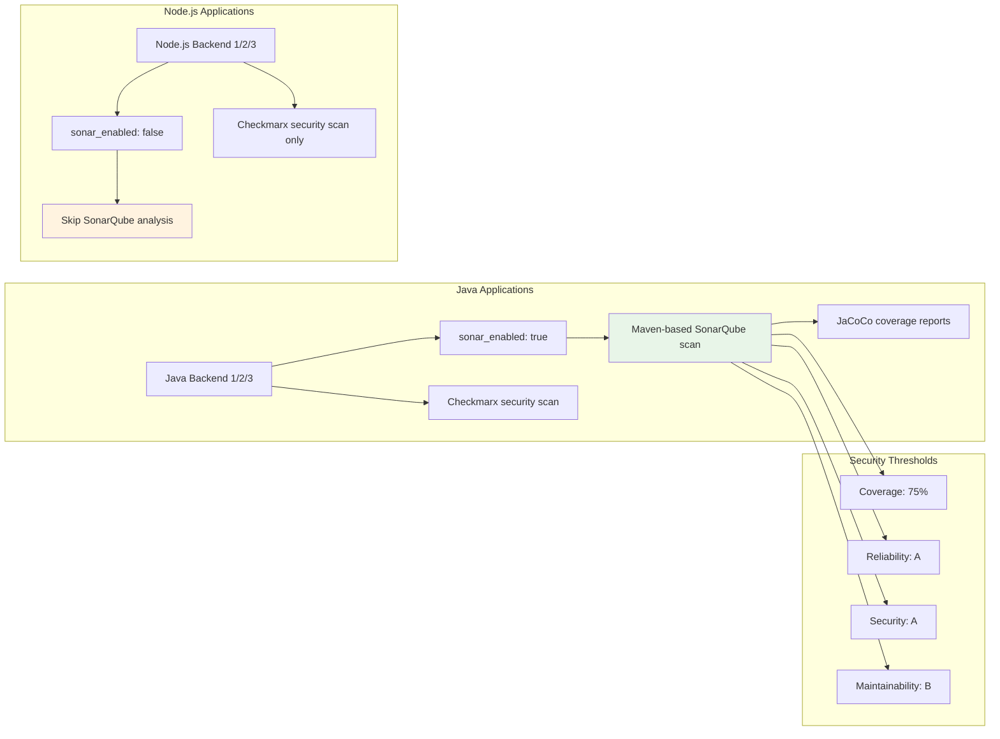

---

## 🎯 Environment Targeting Logic

### Branch-to-Environment Mapping

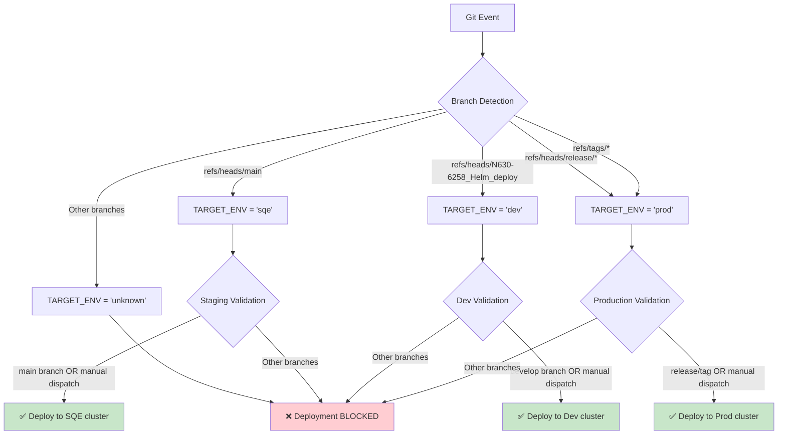

---

## 🔄 Complete Pipeline Dependencies

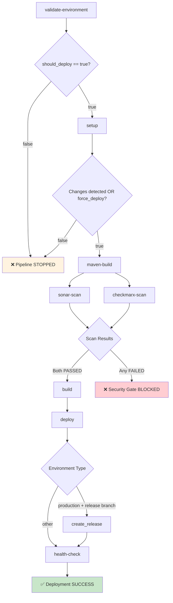

**Note**: Monitoring deployments are now handled separately via `monitoring-deploy.yml` and only trigger when monitoring configurations change.

**Job Dependencies:**
1. **validate-environment** ← Always runs first
2. **setup** ← Requires: validate-environment success
3. **maven-build** ← Requires: setup success + changes detected
4. **sonar-scan + checkmarx-scan** ← Requires: maven-build success (parallel)
5. **build** ← Requires: ALL security scans PASSED
6. **deploy** ← Requires: build success
7. **create_release** ← Requires: deploy success + production environment
8. **health-check** ← Requires: deploy success

---

## 📊 Monitoring Stack Deployment Flow

### Overview: Monitoring vs Application Deployments

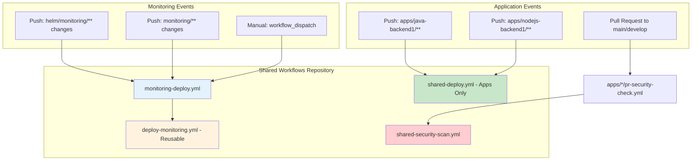

### Monitoring Workflow Architecture

**🏗️ Two-Layer Architecture:**

1. **Caller Workflow**: `monitoring-deploy.yml` (in shared repository)
2. **Shared Workflow**: `deploy-monitoring.yml` (reusable workflow)

### Detailed Monitoring Deployment Flow

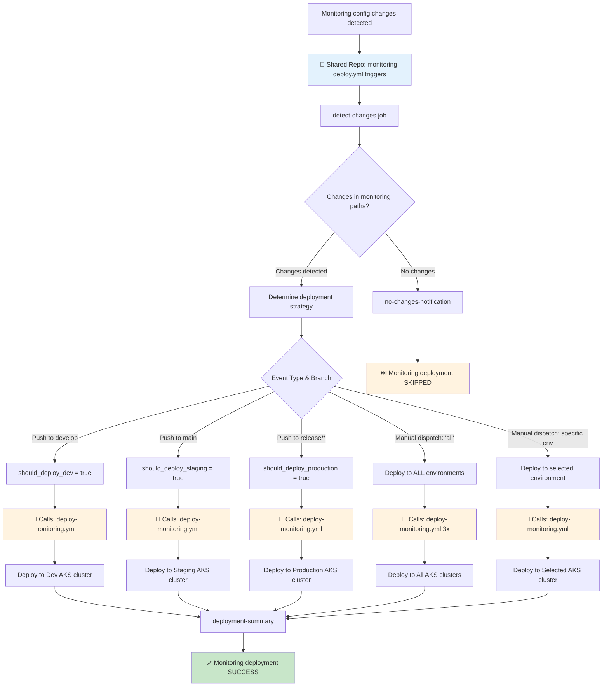

### 🎯 Monitoring Workflow Triggers

#### **1. 📂 Automatic Triggers (Path-Based)**

| File Path Changes | Trigger Event | Target Environment |
|------------------|---------------|-------------------|
| `helm/monitoring/**` | Push to develop | Dev environment |
| `helm/monitoring/**` | Push to main | Staging environment |
| `helm/monitoring/**` | Push to release/* | Production environment |
| `monitoring/**` | Push to develop | Dev environment |
| `monitoring/**` | Push to main | Staging environment |
| `.github/workflows/*monitoring*.yml` | Push to any branch | Based on branch |

#### **2. 🎮 Manual Triggers (workflow_dispatch)**

```yaml
# Manual deployment options
Environment Options:
- dev: Deploy only to dev environment
- staging: Deploy only to staging environment  
- production: Deploy only to production environment
- all: Deploy to ALL environments simultaneously

Force Deploy: true/false
- true: Deploy even without config changes
- false: Only deploy if changes detected
```

### 🏗️ Repository Structure & Workflow Placement

#### **✅ Current Architecture (Recommended)**

```
shared-workflows-repo/
├── .github/workflows/
│   ├── monitoring-deploy.yml           # 📍 CALLER: Monitoring trigger workflow
│   ├── deploy-monitoring.yml           # 📍 SHARED: Reusable monitoring deployment
│   ├── shared-deploy.yml               # 📍 SHARED: Application deployment
│   ├── shared-security-scan.yml        # 📍 SHARED: Security scanning
│   └── pr-security-check.yml           # 📍 OLD: Being replaced by app-specific
│   
├── apps/java-backend1/
│   └── .github/workflows/
│       ├── deploy.yml                  # 📍 CALLER: Calls shared-deploy.yml
│       └── pr-security-check.yml       # 📍 CALLER: Calls shared-security-scan.yml
│       
├── apps/nodejs-backend1/
│   └── .github/workflows/
│       ├── deploy.yml                  # 📍 CALLER: Calls shared-deploy.yml
│       └── pr-security-check.yml       # 📍 CALLER: Calls shared-security-scan.yml
```

#### **🎯 Workflow Responsibilities**

| Workflow | Type | Location | Purpose | Triggers |
|----------|------|----------|---------|----------|
| `monitoring-deploy.yml` | **CALLER** | Shared repo root | Monitor config changes & trigger deployments | Push to monitoring paths, manual dispatch |
| `deploy-monitoring.yml` | **SHARED** | Shared repo root | Reusable monitoring deployment logic | Called by monitoring-deploy.yml |
| `shared-deploy.yml` | **SHARED** | Shared repo root | Reusable app deployment logic | Called by apps/*/deploy.yml |
| `apps/*/deploy.yml` | **CALLER** | Each app directory | Trigger app deployments | Push to app paths, manual dispatch |
| `apps/*/pr-security-check.yml` | **CALLER** | Each app directory | Trigger security scans | Pull requests |

### 🔄 Event Flow Examples

#### **Example 1: Monitoring Configuration Change**

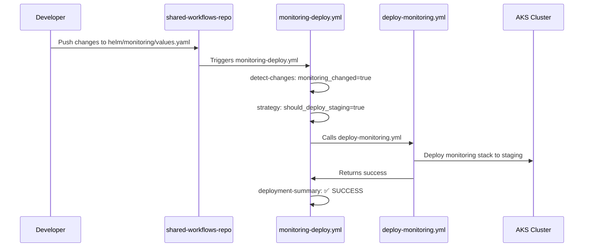

#### **Example 2: Application Deployment (No Monitoring)**

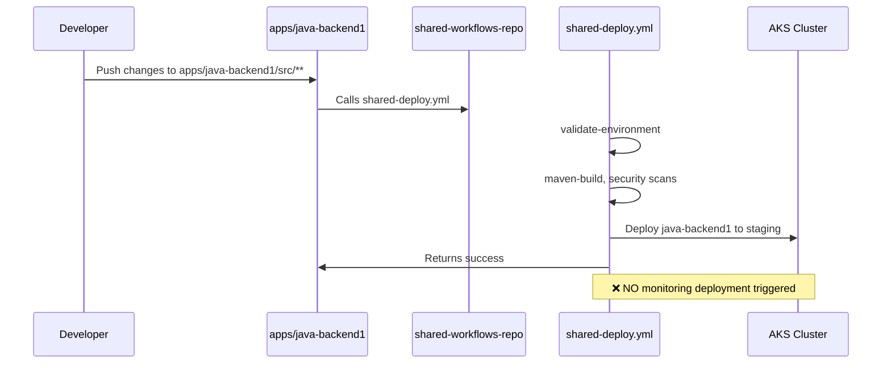

### 🎯 Migration Strategy for Repository Split

#### **When Migrating to Separate Repositories:**

```
# Current (Monorepo)
shared-workflows-repo/
├── .github/workflows/monitoring-deploy.yml     # ✅ STAYS in shared repo
├── .github/workflows/deploy-monitoring.yml     # ✅ STAYS in shared repo
└── apps/java-backend1/                        # 🔄 MOVES to separate repo

# After Migration
shared-workflows-repo/
├── .github/workflows/monitoring-deploy.yml     # ✅ Remains for monitoring
└── .github/workflows/deploy-monitoring.yml     # ✅ Remains for monitoring

java-backend1-repo/
├── .github/workflows/deploy.yml               # 🔄 Updated reference
└── .github/workflows/pr-security-check.yml    # 🔄 Updated reference

# Updated references in java-backend1-repo/deploy.yml:
uses: shared-org/shared-workflows-repo/.github/workflows/shared-deploy.yml@main
```

### 🚨 Key Points

#### **✅ Monitoring Workflows Stay in Shared Repo**
- **Reason**: Monitoring affects all environments and applications
- **Location**: `shared-workflows-repo/.github/workflows/`
- **Triggers**: Only monitoring configuration changes

#### **✅ Application Workflows Move with Apps**
- **Reason**: Each team owns their deployment pipeline
- **Location**: `{app-name}-repo/.github/workflows/`
- **References**: Point to shared repo for reusable workflows

#### **✅ No More Monitoring in App Deployments**
- **Before**: Every app deployment triggered monitoring (wasteful)
- **After**: Only monitoring changes trigger monitoring deployment (efficient)

---

## 📊 Trigger Events Summary

| Event Type | Branch/Pattern | Workflow Triggered | Target Environment | Security Scans | Release Created |
|------------|----------------|-------------------|-------------------|----------------|-----------------|
| **Push** | `main` | `deploy.yml` | SQE (staging) | ✅ Both | ❌ No |
| **Push** | `develop` | `deploy.yml` | Dev | ✅ Both | ❌ No |
| **Push** | `release/*` | `deploy.yml` | Production | ✅ Both | ✅ Yes |
| **Push** | `feature/*` | ❌ None | ❌ None | ❌ None | ❌ No |
| **PR** | `→ main/develop` | `pr-security-check.yml` | ❌ None | ✅ Both | ❌ No |
| **Manual** | Any branch | `deploy.yml` | User choice | ✅ Both | If prod |
| **PR Review** | Any | `pr-security-check.yml` | ❌ None | ✅ Both | ❌ No |
| **Push** | Monitoring changes | `monitoring-deploy.yml` | Based on branch | ❌ None | ❌ No |
| **Manual** | Monitoring dispatch | `monitoring-deploy.yml` | User choice | ❌ None | ❌ No |

---

## 🏗️ Composite Actions Integration

### Shared Actions Flow

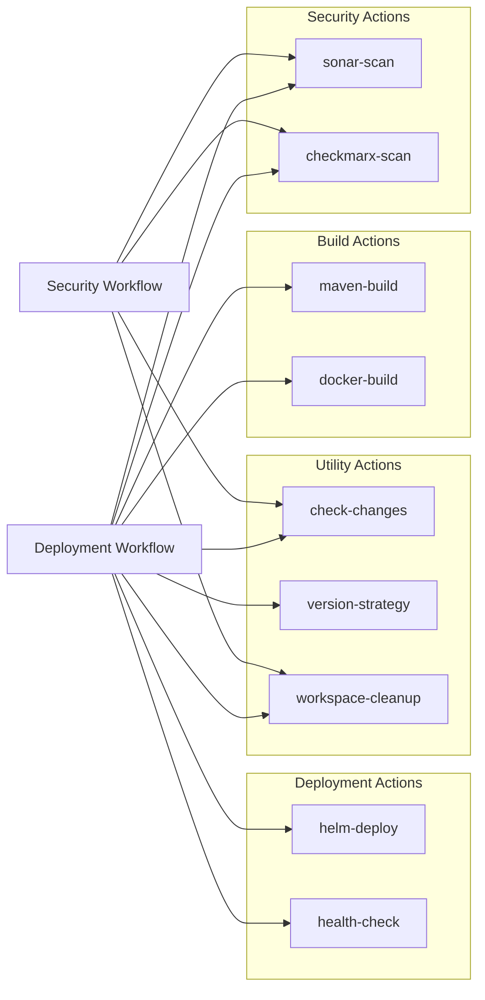

**Key Benefits:**
- **Reusability**: Same actions work for both deployment and security workflows
- **Consistency**: Standardized behavior across all applications
- **Maintainability**: Update once, affects all workflows
- **Configurability**: Actions accept parameters for customization

---

## 🔧 Configuration Parameters

### Deployment Workflow Parameters

```yaml
# Caller → Shared Workflow
environment: 'auto' | 'dev' | 'staging' | 'production'
application_name: string
application_type: 'java-springboot' | 'nodejs'
build_context: path
force_deploy: boolean
aks_cluster_name_*: string
aks_resource_group_*: string
```

### Security Workflow Parameters

```yaml
# Caller → Shared Security Workflow
application_name: string
application_type: 'java-springboot' | 'nodejs'
build_context: path
java_version: '21' (default)
node_version: '20' (default)
sonar_enabled: boolean
checkmarx_enabled: boolean
sonar_coverage_threshold: '75' (default)
sonar_*_rating: '1' | '2' (default thresholds)
```

---

## 🚨 Failure Scenarios

### Security Scan Failures

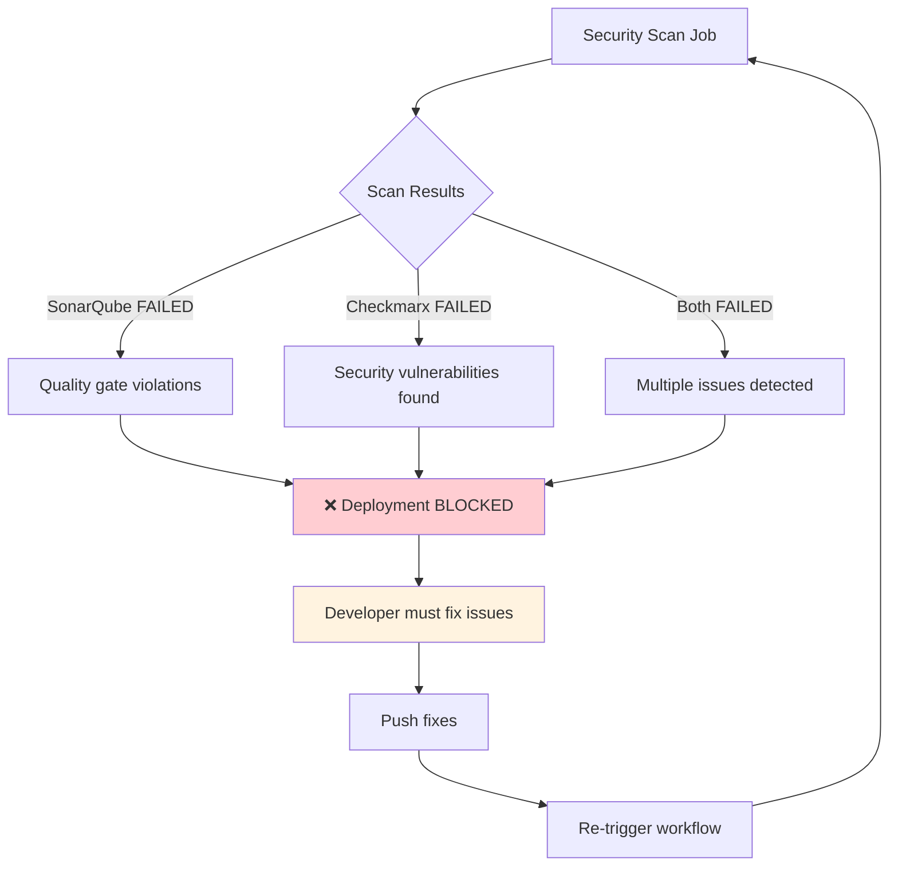

### Environment Validation Failures

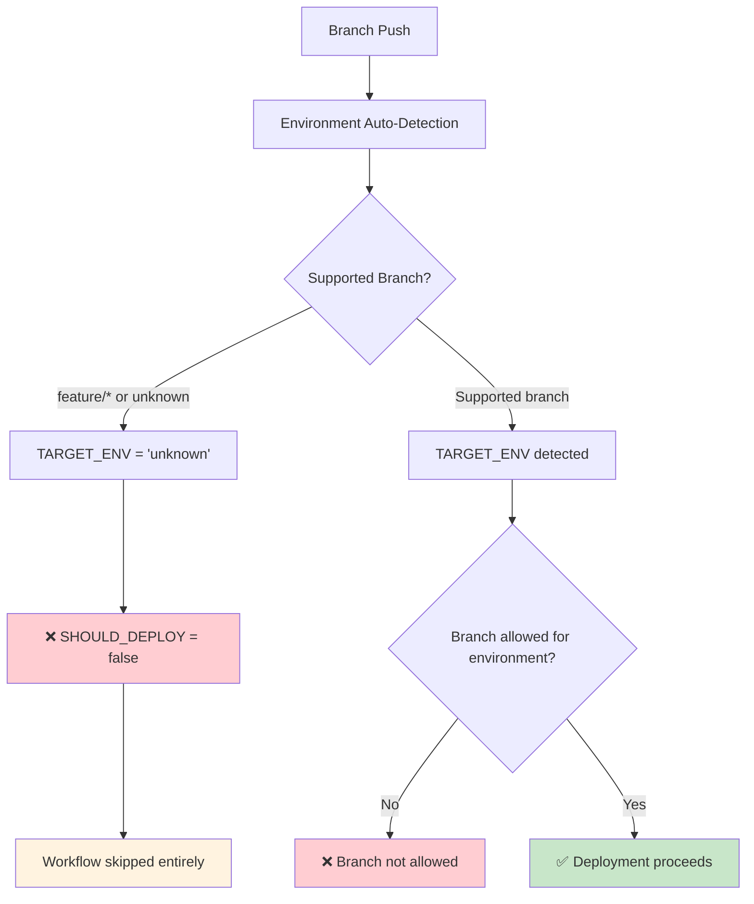

---

## 📋 Troubleshooting Guide

### Common Issues and Solutions

| Issue | Symptoms | Solution |
|-------|----------|----------|
| **Feature branch triggers deployment** | Workflow runs but skips | ✅ **Fixed**: Removed from triggers |
| **Security scan fails** | Deployment blocked | Fix code quality/security issues |
| **Wrong environment deployment** | App in wrong cluster | Check branch naming and manual inputs |
| **Missing secrets** | Authentication failures | Verify secrets configuration in repo |
| **Build failures** | Compilation errors | Fix code issues, verify dependencies |
| **Monitoring deploys on every app change** | Excessive monitoring updates | ✅ **Fixed**: Removed from shared-deploy.yml |
| **Monitoring doesn't deploy** | Config changes ignored | Check file paths match monitoring-deploy.yml triggers |
| **Wrong monitoring environment** | Deployed to wrong cluster | Verify branch corresponds to target environment |

### Monitoring-Specific Troubleshooting

| Issue | Symptoms | Root Cause | Solution |
|-------|----------|------------|----------|
| **Monitoring workflow doesn't trigger** | No deployment despite changes | Files not in monitored paths | Ensure changes are in `helm/monitoring/**` or `monitoring/**` |
| **Monitoring deploys to wrong environment** | Dev config in production | Branch detection logic | Check if pushing to correct branch (develop→dev, main→staging) |
| **Multiple monitoring deployments** | Race conditions, conflicts | Old shared-deploy.yml still has monitoring | Verify `deploy-monitoring` removed from shared-deploy.yml |
| **Manual monitoring deployment fails** | workflow_dispatch doesn't work | Incorrect parameters | Check environment selection and force_deploy settings |
| **No monitoring changes detected** | Workflow skips deployment | Change detection false negative | Use manual dispatch with `force_deploy: true` |

### Debug Commands

```bash
# Check workflow triggers
git log --oneline -10

# Verify branch patterns
git branch -a

# Check application workflow status
gh workflow list
gh run list --workflow=deploy.yml

# Check monitoring workflow status
gh run list --workflow=monitoring-deploy.yml
gh run list --workflow=deploy-monitoring.yml

# Check what files changed (for monitoring trigger debugging)
git diff --name-only HEAD~1 HEAD | grep -E "^helm/monitoring/|^monitoring/|^\.github/workflows/.*monitoring.*\.yml$"

# Manual monitoring deployment
gh workflow run monitoring-deploy.yml -f environment=staging -f force_deploy=true

# Check monitoring deployment logs
gh run view --workflow=monitoring-deploy.yml
```

---

## 🎯 Best Practices

### For Developers

1. **Branch Strategy**:
   - `feature/*` → Create PR for security scans only
   - `main` → Auto-deploys to staging
   - `release/*` → Auto-deploys to production

2. **Security Requirements**:
   - Ensure all security scans pass before merge
   - Fix quality gate violations promptly
   - Monitor security thresholds

3. **Manual Deployments**:
   - Use manual dispatch for hotfixes
   - Select correct environment
   - Verify deployment health post-deploy

### For DevOps Teams

1. **Workflow Maintenance**:
   - Keep composite actions updated
   - Monitor workflow performance
   - Regular security threshold reviews

2. **Environment Management**:
   - Maintain cluster configurations
   - Update secrets regularly
   - Monitor resource usage

---

## 🔗 Related Documentation

- [Azure Setup Guide](./AZURE_SETUP_GUIDE.md)
- [Deployment Verification Guide](./DEPLOYMENT_VERIFICATION_GUIDE.md)
- [Helm Chart Guide](./HELM_CHART_GUIDE.md)
- [Monitoring Setup Guide](./MONITORING_SETUP_GUIDE.md)
- [Spring Boot Profiles and Secrets](./SPRING_BOOT_PROFILES_AND_SECRETS.md)

---

## 📞 Support

For issues or questions about deployment flows:

1. **Check workflow logs** in GitHub Actions
2. **Review this documentation** for expected behavior
3. **Contact DevOps team** for infrastructure issues
4. **Create issue** in shared-workflows repository

---

*This document is maintained by the DevOps team and updated as workflows evolve.*